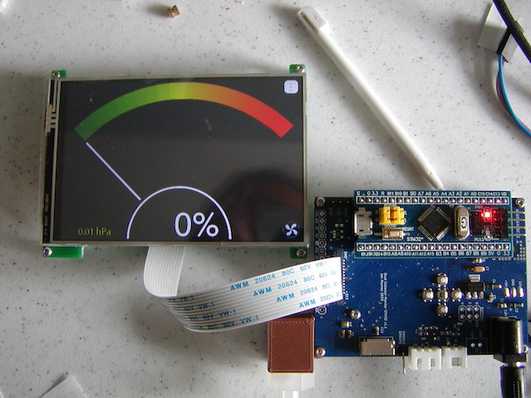
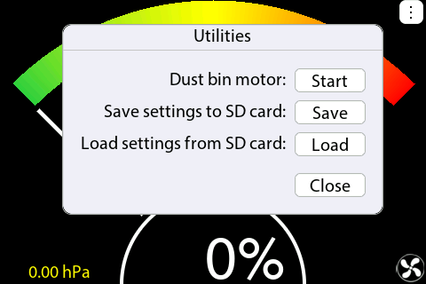
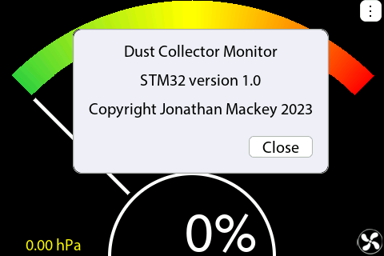

# Dust Collector Monitor V4

  

This is the 4th version of my dust collector project.  The first two versions only monitored the dust bin.  Version 3 added detection of when the filter is loaded and needs to be cleaned.

Version 4 lowers the complexity and cost of version 3 by removing two version 3 features:

- Version 4 does not monitor the open state of your blast gates.
- Version 4 does not send mp3 status messages to your bluetooth equipped hearing protector.

Version 4 has an improved UI that uses a 4 inch TFT LCD Touchscreen.

The software covers one custom board that hosts an off the shelf STM32 "BluePill" module.  The custom board is simple enough that it could be replaced by available Arduino modules and two MOSFETs.

## Touchscreen Support
To support the touchscreen I wrote an XPT2046 touchscreen controller class, and XView, a user interface set of classes that somewhat mimics the Mac OS's appearance.

### XView
XView and all of its subclasses are intended to be statically created.  Particular attention needs to be given to the XView hierarchy because the hierarchy determines both the draw order and how hit testing is performed.  By hiding/showing a view and its subviews, you should be able to emulate dynamically created view hierarchies such as the NSView classes on the Mac.

Commonly used XView subclasses are: XAlert, XCheckboxButton, XDateValueField, XDialogBox, XLabel, XMenuButton, XNumberValueField, XPopUpButton, XPushButton, XRadioButton, and XStepper.

XView subclasses use XFont and the drawing functions found in the DisplayController class.  DisplayController performs copy and fills, draws framed rectangles, rounded rectangles, antialiased lines and circles.  XFont uses the DisplayController to draw bitmapped fonts, both 1-bit and 8-bit antialiased.  In many DisplayController subclasses the fill functions are optimized for the target display.  Fill functions are the basis for all drawing.

To shorten development time, XView hierarchies can be viewed and debugged on a Mac by using the BitmapDisplayController subclass (not in this repository).  The same code that runs on the mcu also runs on the Mac.  This includes the XFont and DisplayController classes.  The ArduinoDisplayTester Xcode project is a modified version of the SubsetFontCreator project available in my SubsetFontCreator repository.  I don't plan on adding the ArduinoDisplayTester to a git repository.

### ST77XXToXPT2046Alignment
The XView subclass ST77XXToXPT2046Alignment is a utility used to align the display with the touch screen.  The result of the alignment session is saved as a preference that is loaded at startup.  Because prior to aligning the touchscreen, the touchscreen can't be used for presice input, the alignment session is initiated by pressing a button on the host board.  Currently the buttons on the host board serve no other purpose.

## DustCollectorBase
The original version 3 DustCollector class has been factored to contain only the features common between version 3 and 4.  The common class is now named DustCollectorBase.  I haven't added DustCollectorBase to the V3 repository yet because it hasn't been thoroughly tested with V3.  DustCollectorBase contains some bug fixes not in the original DustCollector code.

DustCollectorBase monitors the duct pressure in front of the filter to determine when the collector is running and when the filter needs to be cleaned.  This class also controls and monitors a small motor within the dust bin that rotates a paddle.  When the load on the paddle reaches a set point the dust bin is considered full.

### DustCollectorSTM32
DustCollectorSTM32 is a subclass of DustCollectorBase.  DustCollectorSTM32 is responsible for the UI and displays any information and events monitored by the base class.  DustCollectorSTM32 monitors the touchscreen and forwards any pen events to the XView hierarchy.

### STM32UnixRTC
STM32UnixRTC is a subclass of my UnixTime class.  STM32UnixRTC calls functions within rtc.c provided by STMicroelectronics.  I commented out the code within RTC\_init of rtc.c that truncates the 32-bit time storage within the mcu to only the number of seconds past midnight.  The STM32UnixRTC code needs the actual seconds, all 32 bits.  STM32UnixRTC does not use the STM time and date structs RTC\_TimeTypeDef, and RTC_DateTypeDef.  Instead STM32UnixRTC has its own version of ReadRTCCount and WriteRTCCount that accesses the time addresses directly.  This allows you to set and get the time as a 32-bit value and not have to pack and unpack the tedious DOS-like date and time structs.

## Screenshots
(Made using ArduinoDisplayTester)

  
  

  
  

  
  

  
  

  
  

  
  

  
  

See my 
[Dust Collector Monitor V4](https://www.instructables.com/Dust-Collector-Monitor-V4/) instructable for more information.
